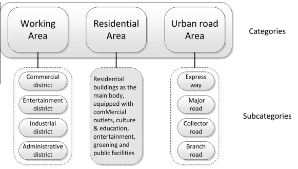
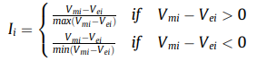
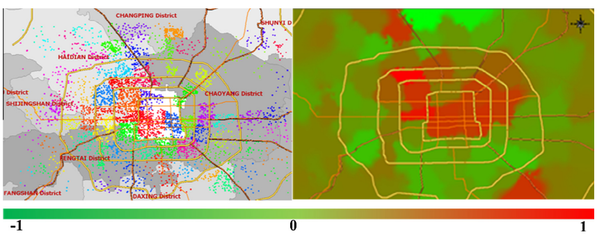

<h1>Paper Review</h1>

<h2>Traffic Zone Division Based on Big Data from Mobile Phone Base Stations</h2>
<blockquote>대용량 데이터를 활용한 교통 지역 분할에 관한 논문입니다. 
  이 논문은 모바일 통신 운영자의 통화 상세 기록 (CDR) 데이터를 활용하여 교통 문제를 분석하고 유용한 정보와 인사이트를 추출하는 방법을 제안합니다. 
  이 논문에서는 CDR 데이터에서 교통 통계 개념을 도출하여 교통 지역의 출발지와 목적지 정보를 추출하고, 이를 교통 지역 분할에 활용하는 방법을 제시합니다.
  또한, 교통 지역 속성 지수와 같은 새로운 개념도 제안합니다.
  이 연구 결과는 도시 계획 및 교통 관련 응용 프로그램에서 유용하게 사용될 수 있습니다.</blockquote>
<h4><li>Call Detail Record(CDR)</li></h4>
모바일 통신사에서 생성되는 통화, 메시지, 데이터 사용 등과 같은 모바일 네트워크 이용 기록을 의미합니다.
<blockquote>
<b>포함된 정보</b> 
  
- 통화 시작 및 종료 시간 
- 통화 유형 (음성, 데이터, SMS 등) 
- 통화 상대방 번호 
- 통화 지역 (셀 타워 ID) 
- 데이터 사용량 
- 로밍 여부 등
</blockquote>
이를 통해 사용자의 통화패턴, 이동경로, 통화시간을 확인할 수 있습니다.
<h4><li>Traffic semantic tagging with clustering method</li></h4>
K-means를 통해 클러스터링하고, Working Area, Residential Area, Urbab road Area로 분류하였습니다.(아래 그림 참고)

한 셀을 기준으로 유저들의 inflow, outflow 시계열(24시간)을 통해 구분하였는데, 이를 통해 <i>Traffic zone attribute index</i>를 정의했습니다.

V_mi: Average Hourly Incremental flow of AM peak hours (7–9 AM)  
V_ei: Average Hourly Incremental flow of PM peak hours (6–8 PM)  
이를 통해 기지국들을 클러스터링한 결과는 아래 사진에 표시하였습니다.

<h2>A Study of Deep Learning Networks on Mobile Traffic Forecasting</h2>
<blockquote>이 논문은 5G 이동통신 기술의 발전에 따라, 대용량 데이터를 기반으로 한 모바일 인터넷 트래픽 예측과 이해가 스마트한 관리 기능을 가능하게 하는 기초가 된다는 것을 강조합니다.
  따라서, 이 논문에서는 최신 딥러닝 모델을 사용하여 모바일 트래픽 예측을 위한 멀티태스크 학습 아키텍처를 제안합니다.
  RNN, 3D CNN 및 CNN-RNN과 같은 최첨단 딥러닝 모델을 연구하고, CNN-RNN이 지리적 및 시간적 트래픽 특징을 추출하는 데 가장 효과적이라는 것을 실험을 통해 밝혀냅니다.
  이 논문은 모바일 트래픽 예측을 위한 딥러닝 모델의 적용 가능성을 탐구하고, 이를 통해 스마트한 관리 기능을 가능하게 하는 것을 목표로 합니다.</blockquote>

<h2>Understanding the Characteristics of Cellular Data Traffic</h2>
<blockquote>대규모 셀룰러 네트워크와 소규모 고정 네트워크에서 수집한 트래픽에 대한 포괄적인 연구 결과를 보고합니다. 이 연구에서는 다음과 같은 세 가지 기여를 합니다. 첫째, 다양한 서비스에 대한 트래픽 특성을 연구하고, 서로 다른 응용 프로그램이 패킷 레벨, 흐름 레벨 및 세션 레벨에서 네트워크 자원에 다른 요구를 부과하는 것을 발견합니다. 둘째, 이러한 결과를 고정 네트워크의 결과와 비교하여 서로 다른 네트워크 접속으로 인해 유발되는 독특한 패턴을 발견합니다. 셋째, 응용 프로그램 간 및 네트워크 유형 간 비교를 수행하여 사용자의 사용 동작을 분석합니다.

저희는 패킷 레벨, 흐름 레벨 및 세션 레벨에서 메트릭을 사용하여 트래픽을 분석합니다. 각 메트릭마다 서로 다른 응용 프로그램의 트래픽과 유선 네트워크의 트래픽을 비교합니다. 마지막으로, 저희의 연구 결과가 셀룰러 인프라에서 더 나은 자원 활용을 위한 함의에 대해 논의합니다.</blockquote>

<h2>Large-Scale Mobile Traffic Analysis: A Survey</h2>
<blockquote>이 논문은 모바일 운영자가 수집한 데이터를 기반으로 모바일 트래픽 분석에 대한 문헌 조사를 수행한 결과를 제시하고 있습니다. 이 논문에서는 다양한 스케일로 분류된 트래픽에 대해 다루고 있으며, 이를 기반으로 연구 분야의 계층적 분류 체계를 제안하고 있습니다. 

이 논문은 모바일 트래픽 데이터를 활용하는 다양한 연구 활동을 식별하고, 주요 카테고리와 하위 카테고리를 정의하여 연구 분야의 계층적 구조를 제시합니다. 이러한 구조는 모바일 트래픽 데이터에 대한 연구 방법론과 결과물을 비교하고 평가하는 데 유용합니다.

또한, 이 논문에서는 다양한 모바일 네트워크 관련 주제에 대해 다루고 있으며, 이러한 주제들은 "모바일 운영자 관점"과 "모바일 사용자 관점"에서 접근됩니다. 따라서, 이 논문은 모바일 네트워크와 관련된 다양한 분야에서 연구자들에게 유용한 정보를 제공합니다.</blockquote>

<h2>Mobile Traffic Forecasting for Maximizing 5G Network Slicing Resource Utilization</h2>
<blockquote>본 논문의 핵심 내용은 5G 네트워크 슬라이싱을 위한 트래픽 예측 및 자원 활용 최적화 방법입니다. 
  이를 위해, 본 논문에서는 네트워크 슬라이싱의 개념과 기술적 도전 과제를 소개하고, 트래픽 예측, admission control, slice scheduling 등의 핵심 기술 요소를 제안합니다. 
  이를 통해, 시스템 활용도를 최대화하면서도 SLA를 충족시키는 방법을 제시하고 있습니다. 또한, 본 논문에서는 admission control 정책의 구현에 대한 고민과 이를 해결하기 위한 geometric knapsack formulation 등의 방법을 제안하고 있습니다.
  이러한 내용을 통해, 5G 네트워크 슬라이싱의 기술적 도전과 가능성에 대한 인사이트를 제공하고 있습니다.</blockquote>

<h4><li>네트워크 슬라이스</li></h4>
<h4><li>SLA</li></h4>
<h4><li>네트워크 슬라이스와 트래픽 예측의 관계</li></h4>
이 부분에서는 각 테넌트별 트래픽 분석 및 예측에 대한 방법을 설명하고 있습니다. 특히, 트래픽 요청이 특정 SLA를 충족하는 트래픽 클래스에 따라 다르게 분류되며, 이를 바탕으로 트래픽 예측이 수행됩니다.

<h2>Citywide Cellular Traffic Prediction Based on Densely Connected Convolutional Neural Networks</h2>
<blockquote>도시 전체의 이동통신 트래픽 예측을 위해 밀집 연결 합성곱 신경망을 사용하는 방법에 대한 내용을 다루고 있습니다. 이 파일에서는 무선 트래픽의 비선형적인 동적을 정확하게 모델링하기 위한 혁신적인 딥러닝 접근 방식을 제시합니다. 트래픽 데이터를 이미지로 처리하고 밀집 연결 합성곱 신경망을 활용하여 공간 및 시간적 의존성을 효과적으로 포착합니다. 또한, 공간 및 시간적 의존성의 영향 정도를 학습하기 위해 매개변수 행렬 기반 퓨전 방법이 제안됩니다. 실험 결과는 기존 알고리즘과 비교하여 예측 성능의 상당한 향상을 보여주며, 텔레콤 이탈리아의 데이터 세트를 사용하여 정확성을 검증합니다.</blockquote>

<h2>Deep Learning and Time Series-to-Image Encoding for Financial Forecasting</h2>
<blockquote>이 논문은 딥러닝과 시계열-이미지 인코딩을 사용하여 금융 예측을 위한 새로운 접근 방식을 제시합니다. 저자들은 Gramian angular fields 이미지를 사용하여 CNNs 앙상블을 훈련시켜 미국 시장의 미래 동향을 예측하는 방법을 제안합니다. 결과는 buy-and-hold 전략을 능가하며 우수한 수익을 제공한다는 것을 보여줍니다.</blockquote>

<h2>A Clustering-Driven Approach to Predict the Traffic Load of Mobile Networks for the Analysis of Base Stations Deployment</h2>
<blockquote>이 논문은 모바일 네트워크에서 기지국의 트래픽 부하를 예측하는 것을 목표로 하고 있습니다. 이를 위해 클러스터링 기반의 머신 러닝 및 통계적 방법을 사용하여 기지국의 트래픽 부하를 예측하고, 이를 통해 에너지 소비를 줄일 수 있는 방안을 모색하고 있습니다. 이 논문은 캐나다 자연과학 및 공학 연구위원회(NSERC)의 지원을 받았습니다</blockquote>
<h4><li>Dataset</li></h4>
<a href=https://github.com/caesar0301/city-cellular-traffic-map>City Cellular Traffic Map (C2TM)</a>  
중국의 13,296개 기지국의 일주일간(7일 또는 168시간) 시간대별 트래픽 부하를 담은 공개 데이터셋을 사용했습니다. 이 데이터셋은 시간대별로 기지국의 트래픽 부하를 기록하고 있으며, 기지국의 위치는 가상의 위도와 경도로 표시되어 있습니다.
